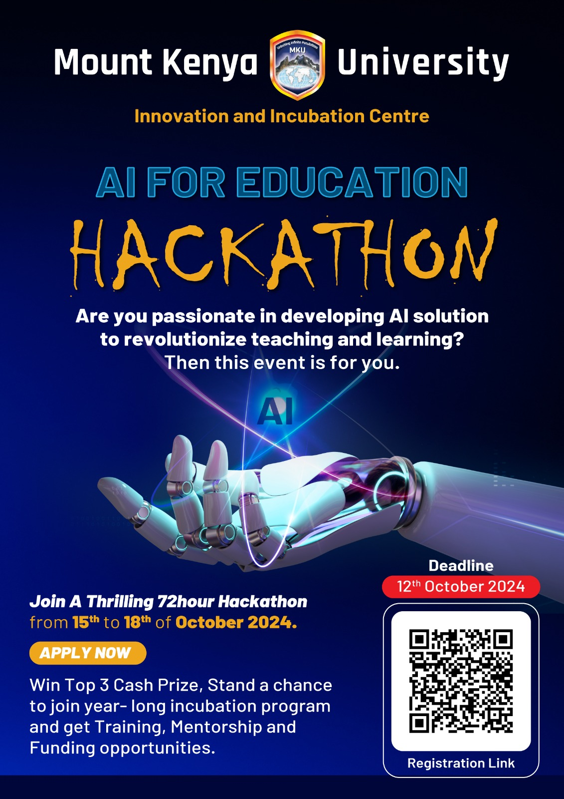

# AI For Education Hackathon - Mount Kenya University



Welcome to the Mount Kenya University AI for Education Hackathon! This hackathon is focused on building AI-powered solutions that can help improve education through automation, personalized learning, and data-driven insights. Participants are required to use artificial intelligence (AI) techniques to solve real-world problems in education.

## Table of Contents
- [Prerequisites](#prerequisites)
- [AI for Education - What It Means](#ai-for-education-what-it-means)
- [Areas to Explore in AI for Education](#areas-to-explore-in-ai-for-education)
- [Tools](#tools)
- [Sample AI for Education Projects](#sample-ai-for-education-projects)
- [Project Setup Instructions](#project-setup-instructions)
  - [Forking and Cloning the Project](#forking-and-cloning-the-project)
  - [Creating a Branch](#creating-a-branch)
  - [Working on Your Branch](#working-on-your-branch)
  - [Tracking and Committing Changes](#tracking-and-committing-changes)
  - [Pushing to GitHub](#pushing-to-github)
  - [Submitting a Pull Request](#submitting-a-pull-request)
- [Explanation File](#explanation-file)
- [Project Evaluation Criteria](#project-evaluation-criteria)
- [Presentation Guidelines](#presentation-guidelines)

## Prerequisites
Before starting, ensure you have the following installed on your machine:
- **Git**: Version control to clone the repository and track your changes.
- **Python 3.x**: The programming language that you'll use to develop your AI solution.
- **Virtual Environment**: To manage dependencies.
- **GitHub Account**: You’ll need it to fork the repository and collaborate.

## AI for Education - What It Means
AI for Education refers to the use of artificial intelligence technologies to enhance educational experiences, optimize learning environments, and provide tailored, data-driven solutions to educational challenges. This can include:
- Personalized learning experiences through AI-driven recommendation engines.
- Automating administrative tasks like grading and scheduling.
- Enhancing student engagement using intelligent tutoring systems.
- Providing analytics to track student performance and predict outcomes.

## Areas to Explore in AI for Education
Here are some key areas where you can focus your AI-driven solution:
1. **Personalized Learning**: Create systems that adapt to individual learning styles and pace.
2. **Automated Grading**: Develop tools that can automatically evaluate and grade assignments.
3. **Student Performance Analysis**: Use machine learning models to predict student success or areas of struggle.
4. **Virtual Teaching Assistants**: AI-powered chatbots that provide instant support to students.
5. **Educational Content Creation**: Automate the creation of quizzes, flashcards, and other study materials.
6. **Data-Driven Decisions**: Develop tools that help educators make informed decisions based on student data.

## Tools
You are free to use any of the following tools or their alternatives:
- **Machine Learning Libraries**: TensorFlow, PyTorch, Scikit-learn.
- **Natural Language Processing**: SpaCy, NLTK, Hugging Face Transformers.
- **Data Handling**: Pandas, NumPy, Matplotlib, Seaborn.
- **Web Frameworks**: Flask, Django (for building web-based educational solutions).
- **GitHub**: For version control and collaboration.

## Sample AI for Education Projects
- **Personalized Course Recommendation System**: AI model that recommends courses based on a student’s learning history and preferences.
- **Automated Essay Grading System**: A machine learning model that can score essays based on predefined criteria.
- **AI Tutor for Math**: Develop an AI-powered chatbot that helps students with math problems.

## Project Setup Instructions

### Forking and Cloning the Project
1. Go to the main repository for the hackathon: [Link](https://github.com/kadimasum/mku-ai-4-education-hackathon).
2. Click on the **Fork** button at the top-right corner of the page to create a copy of the repository in your GitHub account.
3. Once forked, clone the repository to your local machine:

    - If you configured git with ssh use the following command to clone:

   ```bash
   git clone git@github.com:kadimasum/mku-ai-4-education-hackathon.git
   ```
   - Else clone using the following command:
    ```bash
    git clone https://github.com/kadimasum/mku-ai-4-education-hackathon.git
    ```
4. Navigate into the project directory:
   ```bash
   cd mku-ai-4-education-hackathon
   ```

### Creating a Branch
Each participant should create their own branch named after their GitHub username:

- Kindly replace **your-github-username** in the command below with your actual GitHub username.

```bash
git checkout -b your-github-username
```

### Working on Your Branch
Make all the necessary changes and additions to the project in your branch, not on the main branch.
Run the following comand to ensure that you are working on your branch. It should be highlighted with a *.
```bash
git branch
```

### Create your working directory
Create your working directory with the same name as your-github-username and navigate to it. You can use the following command while replacin it with your actual GitHub username:
```bash
mkdir your-github-username && cd your-github-username
```
- Make sure that all your work is in the directory you have just created.

### Tracking and Committing Changes
Track the changes you make and commit them with a meaningful commit message:
1. Track changes:
   ```bash
   git add .
   ```
2. Commit the changes:
   ```bash
   git commit -m "Add solution for AI education problem"
   ```

### Pushing to GitHub
Push your changes to GitHub using the following command:
```bash
git push origin your-github-username
```

### Submitting a Pull Request
1. Once you’ve pushed your code, go to your forked repository on GitHub.
2. Click the **Compare & pull request** button.
3. Submit a pull request to the main repository.
4. In the pull request description, briefly explain your solution and approach.

## Explanation File
Along with your code, include a Markdown file named with your GitHub username (e.g., `your-github-username.md`). This file should contain:
- A detailed explanation of your solution.
- The AI techniques and tools you used.
- Challenges you faced and how you overcame them.

## Project Evaluation Criteria
Your projects will be evaluated based on the following criteria:
1. **Problem-Solving** (25%): How effectively does your solution address the chosen education problem?
2. **AI Usage** (25%): How appropriately is AI applied in your solution?
3. **Innovation** (20%): How creative or novel is your approach?
4. **Technical Implementation** (20%): The complexity and quality of your code.
5. **Presentation** (10%): Clarity and completeness of your presentation.

## Presentation Guidelines
- **Time**: Each team will have **10 minutes** to present their project, followed by **2 minutes** of Q&A.
- Make sure to highlight:
  - The problem you're solving.
  - Your AI approach.
  - The impact of your solution on education.
  - Demo

Good luck, and happy coding! We can’t wait to see your innovative AI for education solutions!